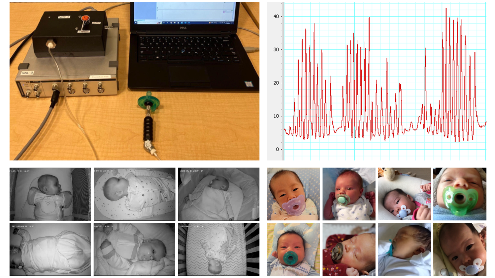
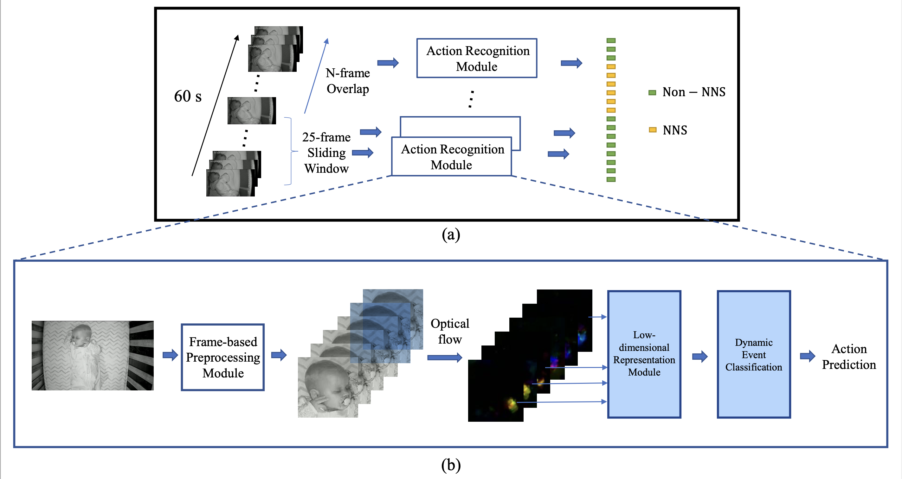

# A Video-based End-to-end Pipeline for Non-nutritive Sucking Action Recognition and Segmentation in Young Infants

This is the official code repository for our paper, introducing a computer vision based detector for infant non-nutritive sucking (NNS):

Zhu, S., Wan, M., Hatamimajoumerd, E., Jain, K., Zlota, S., Kamath, C.V., Rowan, C.B., Grace, E., Goodwin, M.S., Hayes, M.J., Schwartz-Mette, R.A., Zimmerman, E., Ostadabbas, S., "A Video-based End-to-end Pipeline for Non-nutritive Sucking Action  Recognition and Segmentation in Young Infants." MICCAI'23. Preprint, arXiv:2303.16867 [cs.CV], 2023. [[arXiv link](https://arxiv.org/abs/2303.16867)]

A quick-start guide is available for those who just want to get predicted NNS segmentation results from a video, using our pretrained model, with no machine learning training necessary.

#### Table of contents

1. [License & Patents](#license)
2. [Background: NNS & Action Segmentation](#nns-background)
3. [Quick-Start: Obtain NNS Segmentation Predictions](#quick-segmentation)
4. [NNS Datasets](#datasets)
5. [Advanced: Full Pipeline Training & Evaluation](#full-pipeline)
	1. [NNS Action Recognition](#nns-recognition)
	2. [NNS Segmentation](#nns-segmentation)
6. [BibTeX Citation](#bibtex)

<!-- Contents:

* Our public [*NNS In-the-wild Dataset*](#public-dataset) of videos of infants with natural NNS activity, with manually annotated timestamps for NNS event segments.

* Background information on [NNS and Action Segmentation](#nns-background).

* A [step-by-step guide](#model-overview) for applying our algorithm to any infant video, and obtaining a list of predicted start and end timestamps for NNS sucking activity as output. We provide the trained machine learning model, so all you need is the ability to run a Python script (with PyTorch on a GPU) and an infant video to input. -->


Fig. 1. *Top: NNS signal extracted from a pressure transducer pacifier device. Bottom: Image samples from our training and testing datasets.*

## License & Patents
<a name="license"></a>

This code is for non-commercial purpose only. For other uses please contact [ACLab of NEU](https://web.northeastern.edu/ostadabbas/).

This work is related to the following invention disclosures:

1. Ostadabbas, S. and Zimmerman, Emily. 2021. An AI-Guided Contact-less Non-Nutrative Suck Monitoring System. Invention Disclosure INV-22095.
2. Ostadabbas, S., Zimmerman, E., Huang, X., Wan, M. 2022. Infant Facial Landmark Estimation. Invention Disclosure INV-22104.


## Background: NNS & Action Segmentation
<a name="nns-background"></a>

Non-nutritive sucking (NNS) is an infant oral sucking pattern characterized by the absence of nutrient delivery. NNS reflects neural and motor development in early life and may reduce the risk of SIDS, the leading cause of death for US infants aged 1-12 months. However, studying the relationship between NNS patterns and breathing, feeding, and arousal during sleep has been challenging due to the difficulty of measuring the NNS signal. Current transducer-based approaches are effective, but expensive, limited to research use, and may affect the sucking behavior. 

We present an end-to-end computer vision system to recognize and segment NNS actions from lengthy videos, enabling applications in automatic screening and telehealth, with a focus on high precision to enable periods of sucking activity to be reliably extracted for analysis by human experts. Our NNS activity segmentation algorithm predicts start and end timestamps for NNS activity, with high certainty&mdash;in our testing, up to 94.0% average precision and 84.9% average recall across 30 heterogeneous 60 s clips, drawn from our manually annotated NNS clinical in-crib dataset of 183 hours of overnight baby monitor footage from 19 infants.

## Quick-Start: Obtaining NNS Segmentation Predictions
<a name="quick-segmentation"></a>

Follow these steps to obtain NNS segmentation predictions from our model on an input infant video. We provide the pretrained model, and the inference can be done on CPU, so the main prerequisite is a modern Python installation. The output is a demo video illustrating the NNS predictions.

1. Installing the required Python libraries:
```
pip3 install -r requirements.txt
```

2. Set up requirements for the video preprocessing pipeline, which includes importing and optical flow package:
```
cd preprocessing
git clone https://github.com/pathak22/pyflow.git
cd pyflow/
python3 setup.py build_ext -i
cd ../..
```

**Windows users**: Open  `pyflow\src\project.h` and comment out Line 9 (i.e., replace it with `//#define _LINUX_MAC`).

3. Download the model weights from [here](https://coe.northeastern.edu/Research/AClab/NNS/pretrained_model.zip) and unzip the .pth file into your preferred directory.

4. Inference and visualization can be performed on a single video with the following command (after substituting the appropriate `PATH_TO_` variables):
```
python3 inference.py --input_clip_path PATH_TO_INPUT_VIDEO_FILE --output_video_path PATH_TO_OUTPUT_RESULT_VIDEO --model_weights PATH_TO_MODEL_WEIGHT_FILE
```


## NNS Datasets
<a name="datasets"></a>
We present two new datasets in our work: 
* the private **NNS clinical in-crib dataset**, consisting of 183 h of nighttime in-crib baby monitor footage collected from 19 infants and annotated for NNS activity and pacifier use by our interdisciplinary team of behavioral psychology and machine learning researchers, and 
* the public **NNS in-the-wild dataset** [[download]](https://coe.northeastern.edu/Research/AClab/NNS/), consisting of 10 naturalistic infant video clips annotated for NNS activity. 

Fig. 1 shows sample frames from both datasets. Annotations include start and end timestamps for NNS and pacifier events, collected with the [VGG VIA](https://www.robots.ox.ac.uk/~vgg/software/via/) software and saved in their format. See our paper for collection details.


## Advanced: Full Pipeline Training & Evaluation
<a name="full-pipeline"></a>


Fig. 2. *Our global NNS action segmentation pipeline (a), built on our local NNS action recognition (classification) module (b).*

The above figure illustrates our pipeline for NNS action segmentation, which takes in long-form videos of infants using pacifiers and predicts timestamps for NNS events in the entire video. We first cover the long video with short sliding windows, then apply our NNS action recognition module to obtain a classification for NNS vs non-NNS (or the confidence score), and aggregate the output classes (or scores) into a segmentation result consisting of predicted start and end timestamps. 


<!-- **In order to obtain NNS segmentation results for an an infant video**, you currently need to follow all of the steps of our pipeline, first applying the full action recognition [pipeline](#nns-recognition) (including preprocessing the videos and applying the pretrained model), and then applying the segmentation [pipeline](#nns-segmentation). -->

### NNS Action Recognition
<a name="nns-recognition"></a>
The training and evaluation process of the NNS action recognition model includes preprocessing the data and training the model.

#### Preprocessing
The data preprocessing includes the following steps:

1. Trimming the long recordings (10 hr+) into short video clips (e.g. 2.5 s) for the classifier input.
2. Cropping the full scale frames in the short video clips to generate interested-area-only videos.
3. Converting all cropped videos into optical flow videos.

Details of the operations above can be found in the subfolder [preprocessing](preprocessing/readme.md).

#### Action Recognition Model Training

*Note:* This yields the pretrained model, whose weights can also be downloaded directly [here](https://coe.northeastern.edu/Research/AClab/NNS/pretrained_model.zip).

The goal of the pipeline is to train a cnn-lstm based model for classifying the NNS vs Non-NNS actions. 

The training data are the optical flow of the area-of-interest-only short videos generated from the preprocessing section.

The training data setup details and training instructions are in the subfolder [cnn_lstm](cnn_lstm/readme.md).


### NNS Segmentation
<a name="nns-segmentation"></a>

#### NNS Segmentation Predictions

To get the segmentation results, we can run the following script:
```
python3 segmentation.py --opt_flow_dir PATH_TO_OPTICAL_FLOW_DIR --raw_vid_dir PATH_TO_RAW_VIDEOS --results_dir DIR_TO_SAVE_RESULTS \
--model_weights PATH_TO_MODEL_WEIGHT_FILE --sample_dur FRAME_LENGTH_OF_WINDOW --window_stride SLIDING_WINDOW_STRIDE
```
#### Evaluating Segmentation Predictions
To evaluate the NNS segmentation results on the datasets, we can run the following script:

```
python3 evaluation.py --datasets in-wild --agg_methods simple average --result_dir <PATH_TO_SEGMENTATION_NPY_FILES> --num_frames 600 --num_windows 116 --window_size 25 --window_stride 5
```

## BibTeX Citation
<a name="bibtex"></a>

Here is the BibTeX citation for our [paper](https://arxiv.org/abs/2303.16867):

```
@misc{zhu_video-based_2023,
	title = {A {Video}-based {End}-to-end {Pipeline} for {Non}-nutritive {Sucking} {Action} {Recognition} and {Segmentation} in {Young} {Infants}},
	url = {http://arxiv.org/abs/2303.16867},
	author = {Zhu, Shaotong and Wan, Michael and Hatamimajoumerd, Elaheh and Jain, Kashish and Zlota, Samuel and Kamath, Cholpady Vikram and Rowan, Cassandra B. and Grace, Emma C. and Goodwin, Matthew S. and Hayes, Marie J. and Schwartz-Mette, Rebecca A. and Zimmerman, Emily and Ostadabbas, Sarah},
	booktitle={International Conference on Medical Image Computing and Computer-Assisted Intervention (MICCAI) \textbf{(acceptance rate: 32\%)}},
	month = mar,
	year = {2023},
	note = {arXiv:2303.16867 [cs]}
}

@article{zhu2024subtle,
  title={Subtle signals: Video-based detection of infant non-nutritive sucking as a neurodevelopmental cue},
  author={Zhu, Shaotong and Wan, Michael and Manne, Sai Kumar Reddy and Hatamimajoumerd, Elaheh and Hayes, Marie J and Zimmerman, Emily and Ostadabbas, Sarah},
  journal={Computer Vision and Image Understanding},
  pages={104081},
  year={2024},
  publisher={Elsevier}
}
```


